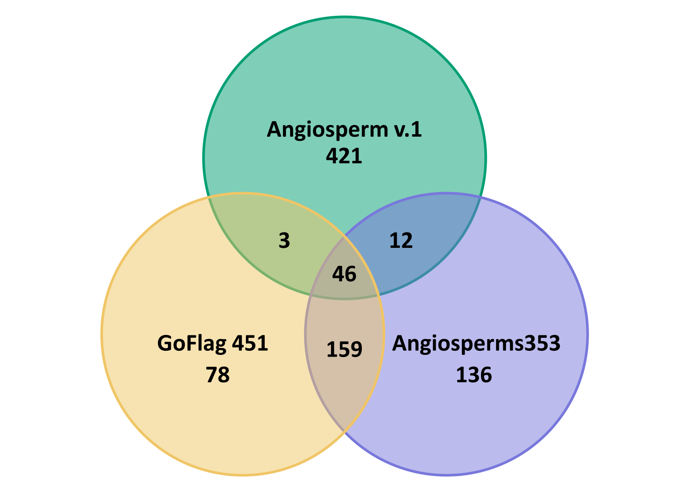

# 🧬 MexTOL

Three main universal **enrichment kits** exist for major land plant lineages, angiosperms: **Angiosperms353** kit of Johnson et al. (2019) and the **Angiosperm v.1** kit of Buddenhagen et al. (2016); and flagellate land plant lineages and gymnosperms: **GoFlag 451** and its optimized version GoFlag 408 (Breinholt et al., 2021). We propose to merge those kits towards a **universal land plant kit**, that maximizes the inclusion of target regions from the above-mentioned universal plant kits.
## 🧬💻 Bioinformatic overview

An ***in-silico*** **test** was performed on the subfamily Pitcairnioideae (except for the outgroup *Tillandsia schiedeana*) of the monocot family Bromeliaceae (Poales) to evaluate the performance of the proposed merged universal land plant kit in terms of loci recovery.

This analysis was based on publicly available and newly generated raw sequence data derived from various sequencing strategies  ([taxon sampling](taxon_sampling/InSilicoTest_TaxonSampling_Bromeliaceae.csv)), including **non-target** (shallow sequencing) and **target** (hybrid enrichment and Hyb-Seq) approaches. Furthermore, target sequencing data was selected to include samples that had been enriched using **Angiosperms353** or **Angiosperm v.1 kits**.

Target regions from the **Angiosperms353**, **Angiosperm v.1**, and **GoFlag451** kits were individually mined (one probe set at a time and following methods detailed in the Workflow section) from the complete  [*Ananas comosus*](https://phytozome-next.jgi.doe.gov/info/Acomosus_v3) nuclear genome. Mined regions were "*de novo*" assembled using the Geneious assembler (Medium sensitivity/Fast) of [Geneious Prime®](https://www.geneious.com/) to identify shared (220) and non-shared (635) regions across the three kits, as shown in the next figure, and to generate a non-redundant target file (855 loci in total). Non-redundant target regions were then mined from the selected raw sequence data.

<p align="center">

</p>

Shared and non-shared target regions on *Ananas comosus* among the **Angiosperms353**, **Angiosperm v.1**, and **GoFlag451** universal kits.

### ⚙️ Workflow

Assembly of raw data, loci extraction and sequence alignments were carried out using [Captus v1.6.1](https://github.com/edgardomortiz/Captus/releases/tag/v1.6.1) (for details on the usage of Captus, go to its documentation).

1. Raw data was first assembled using Captus assemble command:

```{bash}
captus assemble -r raw_data/ -o 02_assemblies/
```

2. Loci were extracted from assemblies using the [target file](target_file/Ananas_comosus_AllKits_TargetFile.fasta) with *Ananas comosus* sequences (go to [captus_logs](captus_logs/) directory for more details on loci recovery stats).

```{bash}
captus extract \
  -a 02_assemblies/ \
  -n Ananas_comosus_AllKits_TargetFile.fasta \
  -o 03_extractions/
```

3. Loci alignment used default settings in Captus (which uses the *auto* algorithm of MAFFT).

```{bash}
captus align -e 03_extractions \
  -o 04_alignments/
```

4. Using **on target** regions sequence alignments, gene trees were inferred with [IQ-TREE 3.0.1](https://github.com/iqtree/iqtree3/releases/tag/v3.0.1), estimating 1000 ultra fast bootstraps for each.

```{bash}
iqtree -S alignments/ \
--prefix mextol-concept \ 
-B 1000
```

5. The 805 resulting **[gene trees](genetrees/mextol-concept.treefile)** were then used to infer the species tree using [ASTRAL-IV v1.23.4.6](https://github.com/chaoszhang/ASTER/releases/tag/v1.23).

```{bash}
astral4 -i mextol-concept.treefile \
-o speciestree.tre -t 8 -R
```

A **summary** of the loci [recovery stats](captus_logs/captus-extract_stats.tsv) and the resulting topology of the [species tree](species_tree/speciestree.tre) is displayed on the following figure.

<p align="center">

</p>
Regardless of the sequencing strategy or enrichment kit used, data could be mined from both shared (90-221 out of 220) and non-shared (331-597 out of 635) target regions across the three universal kits. This includes unique loci of the GoFlag451 kit (19-65 out of 78 loci) that were not originally designed for angiosperms. Analysis of the retrieved nuclear data resulted in a highly supported species tree.

### 📖 Literature

- Breinholt, J.W., et al. 2021. Applications in Plant Sciences 9, e11406. https://doi.org/10.1002/aps3.11406
- Buddenhagen, C., et al. 2016. bioRxiv 086298. https://doi.org/10.1101/086298
- Johnson, M.G., et al. 2019. Systematic Biology 68, 594–606. https://doi.org/10.1093/sysbio/syy086
